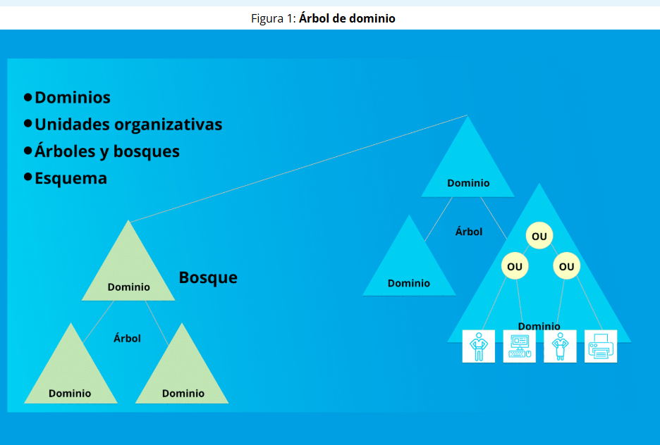
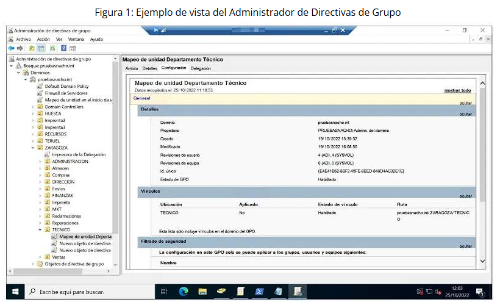
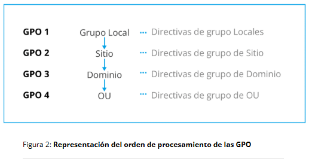

# Tema 1. Profundización de Active Directory
El **elemento principal de AD** es el directorio, que almacena información sobre los recursos de la red y los servicios que hacen disponible la información. Se denominan objetos a los recursos almacenados en el directorio, como:

## Objetos
Los datos del usuario
Impresoras
Servidores
Bases de datos
Grupos
Computadoras
Políticas de sistema

Las **unidades organizacionales** (UO, Organizational Units) son contenedores que se usan para reunir objetos de un dominio en grupos administrativos lógicos. Cada UO puede contener distintos objetos y cada dominio puede tener su propia lógica de agrupación en UOs.

La unidad central de la estructura lógica de AD es el dominio. Agrupando los objetos en uno o más dominios es posible representar la propia organización de la empresa. **Todos los objetos de la red existen en un dominio**. Es posible albergar millones de objetos.

## Estructura lógica de AD
Los elementos que forman parte de la Estructura Lógica del Directorio Activo (Active Directory) son: Árbol de dominio, Bosques, Objetos, Dominios, Unidades Organizativas.

Es recomendable **implementar más de un Controlador de Dominio en una Red**, porque quedará una réplica de los datos del DC principal, en caso de que este fallara o no se encontrara disponible.

## Características de los grupos de seguridad y distribución
Grupos de distribución
Grupos de seguridad
Universal
Global
Dominio Local

# Tema 2. Aproximación a las GPO
GPO (Group Policy Object): Objeto que almacena uno o más valores de configuración aplicables a usuarios o equipos.
En resumen, una GPO actúa como un contenedor de configuraciones, reglas y estados deseados.  

## Gestión de las configuraciones
Ajuste
Ámbito
Aplicación

Cuando nos referimos a las Políticas o Directivas de Grupo, es esencial comprender que el componente más elemental es la Configuración de Directiva Individual. Este elemento, comúnmente conocido como directiva o política, se encarga de especificar un ajuste de configuración particular. 

- Directivas de Ajuste de Configuración de Equipo 	
- Directivas de Configuración de Usuario 

## Orden de aplicación de GPO
El orden de aplicación es el siguiente:

- GPO Locales
- GPO a nivel de Sitio
- GPO a nivel de Dominio

## Orden de procesamiento de GPO

### ¿Cuál es el uso de las GPO en una explotación?

## Herramientas para la gestión de las GPO
- Por un lado, tenemos la **Consola de Administración de Directivas de Grupo**, conocida como "GPMC" por sus siglas en inglés ("Group Policy Management Console"). Esta consola se utiliza para crear, gestionar y vincular las directivas de grupo. 
- Después tenemos el **Editor de Administración de Directiva de Grupo**, que permite crear y editar políticas. Normalmente, se accede a este editor desde la GPMC para desarrollar las políticas en detalle. 
- Por otro lado, tenemos los comandos "GPUpdate" y "GPResult" utilizados en CMD. Estos comandos se emplean para realizar tareas de actualización y verificación de las implementaciones de Políticas de Grupo. 
- Por último, es posible gestionar las políticas mediante cmdlets de PowerShell utilizando el módulo Group Policy. 

## ¿Dónde se almacenan las GPO?
- Los contenedores de almacenamiento de directivas
- Las plantillas de configuración

Un contenedor de directivas es uno de los objetos que componen AD DS y que, básicamente, es creado para mantener las GPO acotadas y organizadas dentro de un espacio único.

Una plantilla de Directivas de Grupo se conforma por una serie de archivos que se encuentran dentro de la carpeta **SYSVOL**, Esta es una carpeta que se replica a cada uno de los controladores de dominio, almacenándose dentro de SYSVOL, y más concretamente en %SystemRoot%\SYSVOL\Domains\Policy\GPOGUID, siendo GPO GUID el GUID del contenedor.

- Microsoft. (s.f.). Group Policy Management Console. Microsoft Learn.  https://learn.microsoft.com/es-es/windows-server/identity/ad-ds/manage/group-policy/group-policy-management-console(opens in a new tab)
- Microsoft. (s.f.). Active Directory Domain Services overview. Microsoft Learn. https://learn.microsoft.com/es-es/windows-server/identity/ad-ds/get-started/virtual-dc/active-directory-domain-services-overview

- JGAITPro. (2014). Windows Server 2012 R2 – Crear políticas de grupo (GPO).  https://blogs.itpro.es/jairgomez/2014/05/25/windows-server-2012-r2-crear-polticas-de-grupo-gpo/(opens in a new tab)
- Jotelulu. (s.f.). ¿Qué son y para qué sirven las GPO? Jotelulu. https://jotelulu.com/blog/que-son-y-para-que-sirven-las-gpo/(opens in a new tab)
- ORSI Informática Profesional. (s.f.). Active Directory: Guía completa sobre GPO, directivas de seguridad y dominios compatibles. https://www.orsl.es(opens in a new tab)
- Ragasys Sistemas. (2020). Administración de directivas de grupo (GPO) sobre MS Windows Server 2016. https://blog.ragasys.es