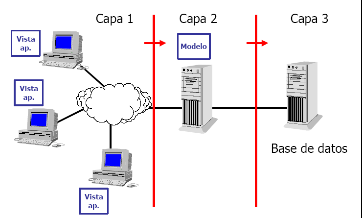
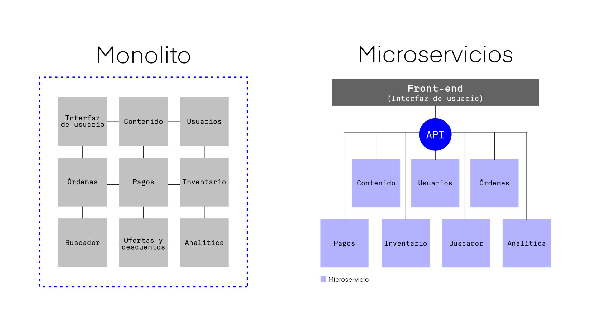
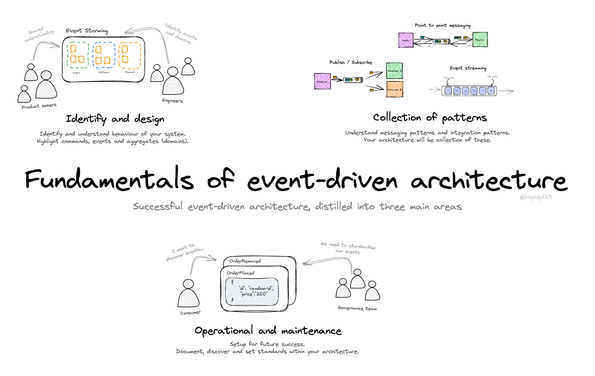

##### Clase 9 (08:45 - 11:55 / 3 horas 10 min)
#### 8:45 - 9:30 / 9:45 - 10:30 / 10:45 - 11:30

### 3.1.1 Considerando una metodología ágil en el proceso de desarrollo.
### 3.1.2 Considerando las etapas del ciclo de vida en el desarrollo del software.
| **Aspecto**                   | **Proyectos Tradicionales (Cascada)**                        | **Proyectos Ágiles**                              |
| ----------------------------- | ------------------------------------------------------------ | ------------------------------------------------- |
| **Enfoque**                   | Secuencial (paso a paso)                                     | Iterativo e incremental                           |
| **Planificación**             | Extensa al inicio del proyecto                               | Continua y adaptable durante todo el proyecto     |
| **Requisitos**                | Se definen completamente al inicio                           | Evolucionan según necesidades y retroalimentación |
| **Flexibilidad ante cambios** | Baja, cambios son costosos y complicados                     | Alta, cambios son esperados y bienvenidos         |
| **Participación del cliente** | Limitada, principalmente al inicio y al final                | Activa y constante durante todo el proceso        |
| **Duración de las fases**     | Largas fases definidas (análisis, diseño, implementación...) | Sprints cortos y repetitivos (1-4 semanas)        |
| **Entrega del producto**      | Al final del proyecto                                        | Entregas parciales y frecuentes (incrementos)     |
| **Documentación**             | Abundante y detallada                                        | Solo la necesaria, enfocada en el valor funcional |
| **Gestión del equipo**        | Jerárquica                                                   | Colaborativa y autoorganizada                     |
| **Evaluación del progreso**   | Medido por el cumplimiento del plan y fechas                 | Medido por el software funcional entregado        |

# **Estilos arquitectónicos**:
##  - Arquitectura en capas

## - Cliente-servidor

## - Microservicios

## - Event-driven

