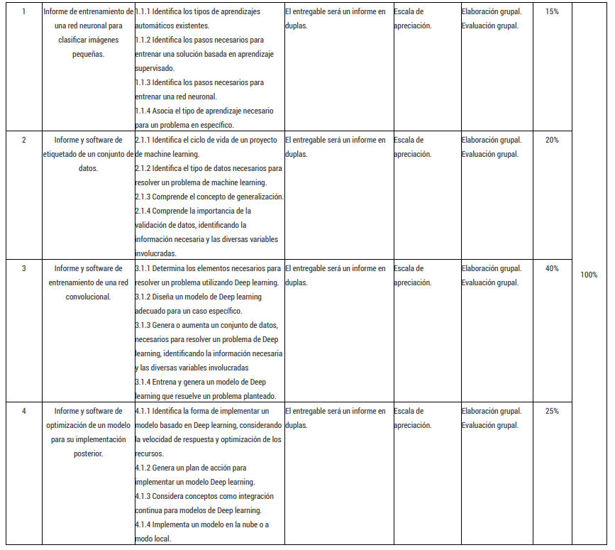

# 1. Introducción al machine learning. 
1.1 Explica los conceptos básicos del machine learning, describiendo las diferencias entre aprendizaje supervisado, no supervisado y aprendizaje
por refuerzos.
1.1.1 Identifica los tipos de aprendizajes automáticos existentes.
1.1.2 Identifica los pasos necesarios para entrenar una solución basada en aprendizaje supervisado.
1.1.3 Identifica los pasos necesarios para entrenar una red neuronal.
1.1.4 Asocia el tipo de aprendizaje necesario para un problema en específico.

Concepto de: 
- Aprendizaje no supervisado 
- Aprendizaje por refuerzos 
- Aprendizaje supervisado.
- Redes neuronales.
- Backpropagation.
- Entrenamiento.
- Python y Machine Learning.

# 2. Recolección y preparación de datos. 
2.1 Describe los requerimientos necesarios de un conjunto de datos, para resolver un
problema particular que involucre machine learning. (Integrada Competencia Genérica,
Resolución de Problemas, nivel 2)

2.1.1 Identifica el tipo de datos necesarios para resolver un problema de machine learning.
2.1.2 Comprende el concepto de generalización.
2.1.3 Comprende la importancia de la validación de datos, identificando la información necesaria y las diversas variables involucradas.

Concepto de: 
- Etiquetado de datos.
- Aumento de datos.
- Generalización.
- Overfiting.
- Validación cruzada.

# 3. Deep learning. 
3.1 Entrena una solución, con elementos necesarios, basada
en Deep learning. (Integrada Competencia Genérica,
Resolución de Problemas, nivel 2)

3.1.1 Determina los elementos necesarios para resolver un problema utilizando Deep learning.
3.1.2 Diseña un modelo de Deep learning adecuado para un caso específico.
3.1.3 Genera o aumenta un conjunto de datos, necesarios para resolver un problema de Deep learning, identificando la información
necesaria y las diversas variables involucradas.
3.1.4 Genera un modelo de Deep learning que resuelve un problema planteado

Concepto de: 
- Deep learning (Redes Convolucionales – LSTM – GAN – Auto codificadores).
- Fine tuning (ajuste fino).

# 4. Implementación modelo Deep learning. 
4.1 Implementa un modelo Deep learning en modo de producción,
teniendo en cuenta la velocidad y optimización de los recursos.

4.1.1 Identifica la forma de implementar un modelo basado en Deep learning, considerando la velocidad de respuesta y optimización de los recursos.
4.1.2 Genera un plan de acción para implementar un modelo Deep learning.
4.1.3 Considera integración continua para modelos de Deep learning.
4.1.4 Implementa un modelo en la nube o en modo local.

Concepto de: 
Cuantificación.
Poda de redes.
ONNX.
Integración Continua.
Servicios cloud machine learning.
Edge computing.

# Evaluaciones
