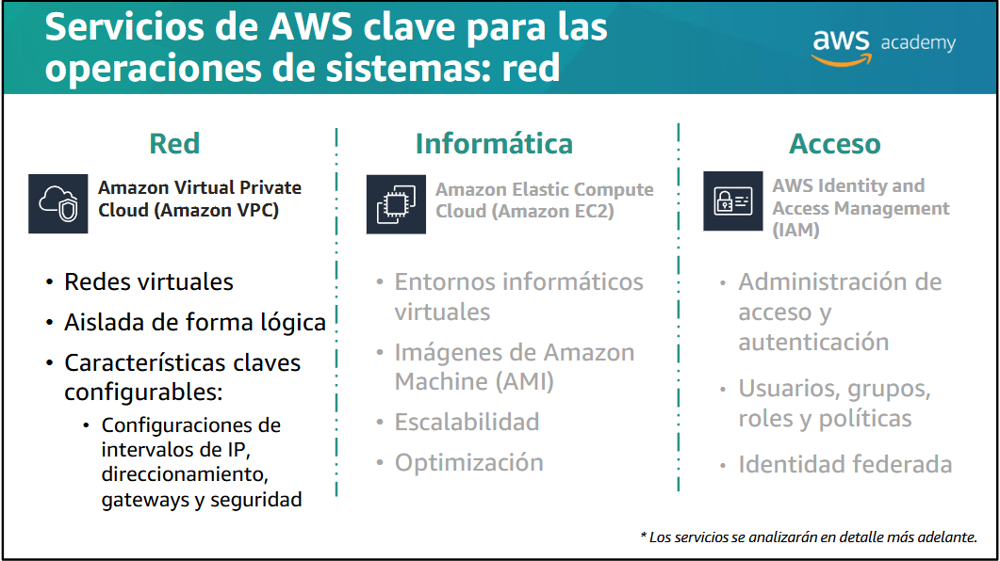

# Descripción general de los laboratorios
## Módulo 1:
## Al final de este módulo, podrá realizar lo siguiente:
•Describirlas operaciones de sistemas en la nube que se relacionan con implementaciones repetibles y automatizadas
•Explicar qué son las regiones de Amazon Web Services(AWS) y las ubicaciones de borde, y los criterios para seleccionarlas 
•Describir los servicios principales relacionados con las operaciones de sistemas, incluidos los servicios para red, informática y acceso
•Explicarcómo AWS Identityand Access Management (IAM) proporciona seguridad a través de los recursos de cuenta de AWS
•Describir las características de la interfaz de línea de comandos de AWS (CLI de AWS)
## SYSOPS (Tareas y responsabilidades de las Operaciones de Sistemas)
- Compilación
- Prueba
- Implementación
- Monitoreo
- Mantenimiento
- Protección <br>

# Introducción a IAMAWS Identityand Access Management (IAM)
Red (VPC), informática (EC2), Acceso (IAM) Identity Access Management<br>
Usuarios, grupos, roles<br>
Políticas<br>
IAM => Acceso a los servicios de AWS <br>


# Service Limits en AWS
Pendiente 
# Tipos de credenciales de seguridad
- Dirección de email y contraseña
- Nombre de usuario y contraseña de IAM
- Claves de acceso 
- Autenticación multifactor (MFA) 
- Pares de claves
## Tipos de políticas
- basado en la identidar
- " en los recursos
- SCP: Política de Control de Servicios
- ACL: <br>

Ejemplo:
```
{
    "Version": "2012-10-17",
    "Statement": [{
        "Sid": "MFA-Access",
        "Effect": "Allow",
        "Action": "ec2:*",
        "Resource": "*",
        "Condition": {
            "BoolIfExists": {
                "aws:MultiFactorAuthPresent": "true"
            },
            "IpAddress": {
                "aws:SourceIp": "1.2.3.4/32"
            }
        }
    }]
}
```
# Crear un usuario y un grupo de IAM
Pendiente
# Tres maneras de utilizar AWS
- Consola de administración de AWS
- Interfaz de línea de comandos de AWS (CLI de AWS)
- Kits de desarrollo de software (SDK)
# Instalar la CLI de AWS en Linux
Pendiente
## Introducción a la CLI de AWS
aws configure
## Formato de línea de comandos
```bash
# Detener una instancia EC2 específica y mostrar la salida en formato JSON
aws ec2 stop-instances --instance-ids i-1234567890abcdef0 --output json
# Iniciar una nueva instancia EC2 usando un archivo JSON como entrada
aws ec2 run-instances --cli-input-json file://webserver.json
# Obtener ayuda sobre el comando describe-instances
aws ec2 describe-instances help
# Solicitar detalles de todas las instancias EC2 existentes en la cuenta
aws ec2 describe-instances
```
## Limitación de resultados: opción --query
```bash
# Mostrar solo la primera instancia de Amazon EC2 en la lista:
aws ec2 describe-instances–-query 'Reservations[0].Instances[0]'
# Mostrar el estado indicado de la primera instancia:
aws ec2 describe-instances--query 'Reservations[0].Instances[0].State.Name'
# Mostrar el estado indicado de todas las instancias con el comodín (*):
aws ec2 describe-instances--query 'Reservations[*].Instances[*].State.Name'
```
## Limitación de resultados: opción --filter
```bash
# Mostrar solo las instancias de Windows:
aws ec2 describe-instances–-filter "Name=platform,Values=windows"
# Busca las ID de instancia de todas las instancias en la cuenta, pero muestra solo las ID de las instancias t2.micro y t2.small:
aws ec2 describe-instances\--query "Reservations[*].Instances[*].InstanceId” \–-filter “Name=instance-type,Values=t2.micro,t2.small”
```
## Otras opciones de CLI: --dry-run
```bash
# Comprueba los permisos necesarios sin hacer una solicitud.
# Proporciona una respuesta de error si no se tiene la autorización.
aws ec2 run-instances--image-id ami-1a2b3c4d --count 1 --instance-type c5.large --key-name MyKeyPair --security-groups MySecurityGroup --dry-run
```
## Comandos comunes de la CLI
### Amazon EC2
```bash
# Este comando lanza la cantidad especificada de instancias de una AMI. 
aws ec2 run-instances
# Describe cualquier instancia que exista en la cuenta.
aws ec2 describe-instances 
# Crea un volumen de Amazon EBS que se puede asociar a una instancia de la misma zona de disponibilidad. 
aws ec2 create-volume
# Crea una VPC con el bloque especificado de direccionamiento de dominios sin clase (CIDR)
aws ec2 create-vpc
```
### Amazon S3
```bash
# Enumera los objetos Amazon S3 y los prefijos comunes a un prefijo o a todos los buckets de Amazon S3. De manera opcional, especifique un bucket específico en la cuenta, y el comando lsenumerará los Pendientes del bucket especificado.
aws s3 ls
# Copia un archivo a, desde o entre ubicaciones de Amazon S3. Úselo para copiar archivos locales a Amazon S3, copiar un archivo desde Amazon S3 a un portátil o copiar archivos de Amazon S3 a otras ubicaciones de Amazon S3. 
aws s3 cp
# Mueve un archivo file u objeto de Amazon S3 a otra ubicación local o en Amazon S3.
aws s3 mv
# Elimina un objeto de AmazonS3
aws s3 rm
```
### Los formatos de resultados de la CLI incluyen lo siguiente:
- JSON
- Texto
- Tabla
# AWS CLI

- El diagrama de arriba resume las actividades que realizará en esta actividad.
- Debe establecer una conexión Secure Shell (SSH) para la instancia. 
- A continuación, debe configurar la instalación con una clave de acceso que se puede conectar a una cuenta de AWS. 
- Finalmente, debe practicar cómo utilizar la CLI de AWS para interactuar con AWS Identity Access and Management (IAM).
## ¿Por qué utilizaría la CLI de AWS en lugar de la consola de administración de AWS?
- Automatizar la creación y construcción de una infraestructura
- Facilitar las tareas relacionadas con la administración ejecutando cientos de comandos a través de script
