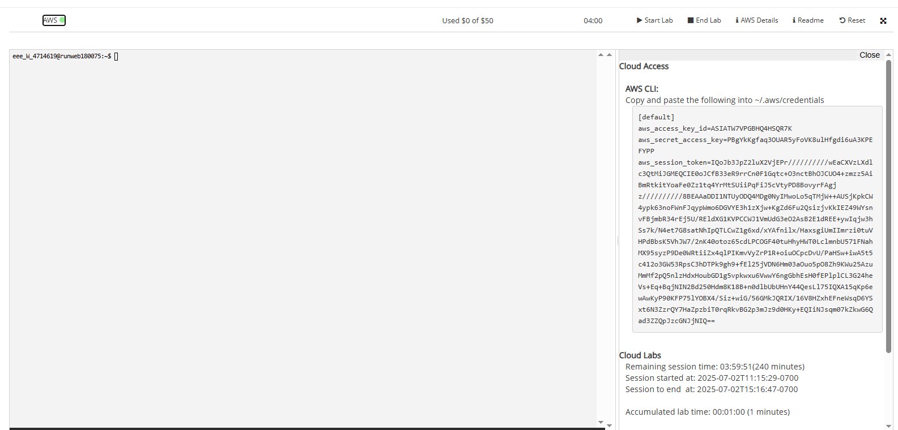
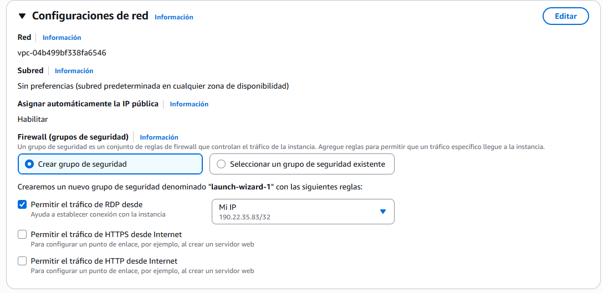
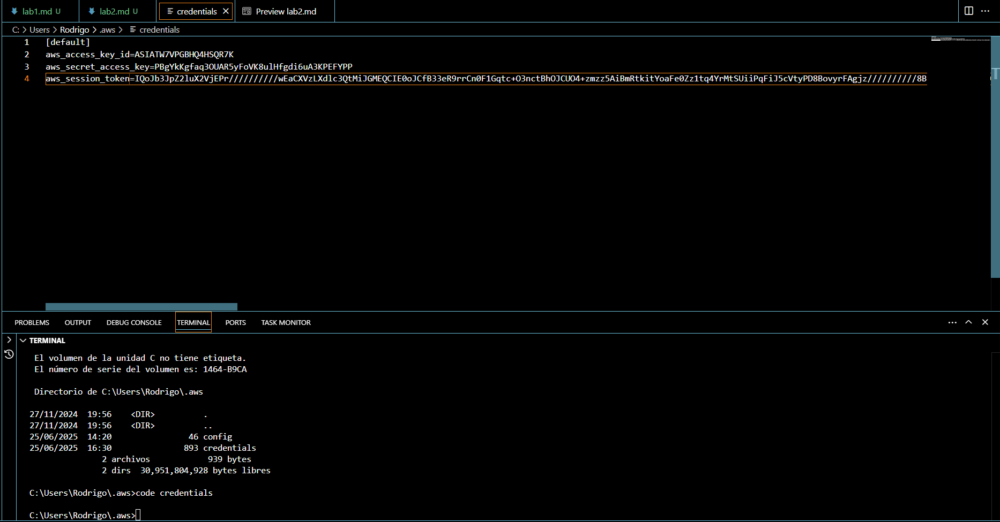
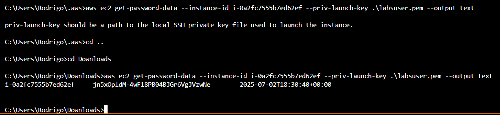
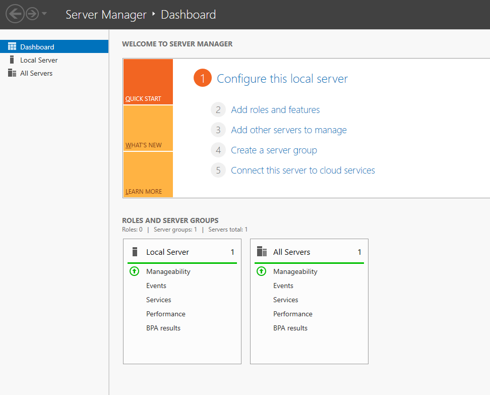

# Iniciar el Laboratorio de aprendizaje de AWS Academy
# Laboratorio 2: Configuración básica de Windows Server en AWS Academy
## Instrucciones 
```
https://chatgpt.com/share/68657850-1744-8012-9d51-7906336b02ca
```

### 1. Lanzar una instancia EC2 con Windows Server

### 2. Conectarse por RDP
#### Obtener la contraseña desde:

```
aws ec2 get-password-data --instance-id i-xxxxxx --priv-launch-key .\mi-clave.pem --output text
# i-0a2fc7555b7ed62ef
aws ec2 get-password-data --instance-id i-0a2fc7555b7ed62ef --priv-launch-key .\labsuser.pem --output text
# i-0bf36b4c9605ee15f
aws ec2 get-password-data --instance-id i-0bf36b4c9605ee15f --priv-launch-key .\labsuser.pem --output text
```

jn5xOpldM-4wF18PB04BJGr6VgJVzwNe
rY$!cKLLeHKfL@?;q4iwQw%CxCEFTu-v
#### Copiar la IP pública de la instancia.

44.202.57.202
54.173.148.8
#### Conectar usando Remote Desktop Connection (RDP) con:
```
WIN + R
mstsc
```
### 3. Configurar Windows Server (Este paso arruinó mi instancia)
#### Cambiar nombre del equipo:
Control Panel > System & Security > System > Rename this PC. (Requiere reinicio)
#### Configurar IP estática:
Control Panel > Network & internet > Network and Sharing Center > Ethernet 2 > Properties > Internet Protocol Version 4 > Properties 
Usar una IP privada fija dentro del rango de tu VPC.
##### 🧾 Cómo llenar tu ventana de configuración IPv4:
| Campo                    | Valor                                          |
| ------------------------ | ---------------------------------------------- |
| **IP address**           | `172.31.90.64`                                 |
| **Subnet mask**          | `255.255.240.0`                                |
| **Default gateway**      | `172.31.90.1` *(asumido)*                      |
| **Preferred DNS server** | `172.31.90.64` *(si estás en el DC)*           |
| **Alternate DNS**        | *(vacío o `8.8.8.8` si deseas acceso externo)* |
#### Instalar roles desde Server Manager:
Agregar Roles y Características
Seleccionar: Active Directory Domain Services (AD DS)
Instalar.

